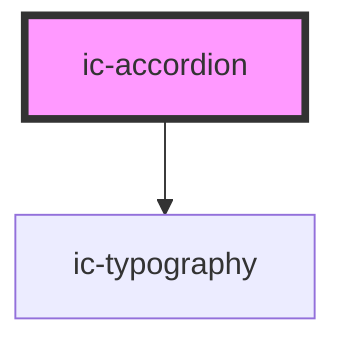

# ic-accordion

<!-- Auto Generated Below -->

## Properties

| Property   | Attribute  | Description                                              | Type                              | Default     |
| ---------- | ---------- | -------------------------------------------------------- | --------------------------------- | ----------- |
| `disabled` | `disabled` | If `true`, the card will be disabled if it is clickable. | `boolean`                         | `false`     |
| `expanded` | `expanded` | If true, the accordion appears expanded.                 | `boolean`                         | `false`     |
| `heading`  | `heading`  | The section header outlining section content.            | `string`                          | `""`        |
| `message`  | `message`  | The main body message of the card.                       | `string`                          | `""`        |
| `size`     | `size`     | The size of the accordion.                               | `"default" \| "large" \| "small"` | `"default"` |

## Dependencies

### Depends on

- [ic-typography](../ic-typography)

### Graph

----------------------------------------------

